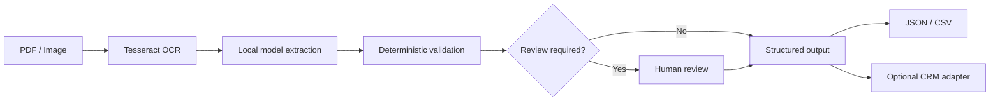

# MoneyPulse

MoneyPulse is an experimental, local-first financial document processing pipeline for Merchant Cash Advance (MCA) and related operational workflows. It combines OCR, local model-based extraction, deterministic validation, structured exports, and optional CRM integration.

> **Status:** active modernization. MoneyPulse is a portfolio/open-source project and is not a production underwriting, compliance, or decisioning system. Extracted data should be reviewed before it is used in a financial workflow.

## What it does

The current pipeline is designed around:

1. **Document intake** — PDF, PNG, JPG, and JPEG files.
2. **OCR** — Tesseract-based text extraction with image preprocessing.
3. **Local model parsing** — the primary parser uses Hugging Face Transformers and can run on CPU or CUDA.
4. **Validation** — deterministic checks for fields such as EIN/SSN, ZIP code, phone number, email, state, and requested amount.
5. **Human-review flags** — validation issues are surfaced instead of silently accepted.
6. **Structured output** — JSON and CSV artifacts for downstream workflows.
7. **CRM integration** — a mock/local submission flow is included for development, plus configurable REST/SOAP integration code for external systems.

The repository also contains local-provider detection code for **Ollama, LM Studio, and llama.cpp-compatible endpoints**. Consolidating those providers behind one parser interface is part of the modernization roadmap.

## Architecture



## Privacy model

MoneyPulse is designed to support local processing. OCR and the primary Transformers parser can operate on the same machine as the documents.

A few important details:

- Python packages and model weights may require network access during initial installation/download unless they are already cached or supplied offline.
- Optional CRM connectors make network requests when configured.
- No claim is made that a particular deployment is compliant with a specific regulation or security standard. Deployment security depends on how the software, model runtime, operating system, storage, and integrations are configured.

## Requirements

- Python 3.9+
- Tesseract OCR
- Poppler for PDF-to-image conversion used by `pdf2image`
- Sufficient memory for the selected local model
- Optional CUDA-capable GPU for faster local inference

## Installation

```bash
git clone https://github.com/JDavydovPortfolio/MoneyPulse.git
cd MoneyPulse

python -m venv .venv
```

Activate the environment:

**Windows PowerShell**

```powershell
.\.venv\Scripts\Activate.ps1
```

**macOS / Linux**

```bash
source .venv/bin/activate
```

Install dependencies:

```bash
python -m pip install --upgrade pip
pip install -r requirements.txt
```

For the lighter OCR-oriented dependency set:

```bash
pip install -r requirements-minimal.txt
```

## Run

```bash
python main.py
```

The desktop application creates/uses:

- `input/` for source documents
- `output/` for generated JSON/CSV data
- `logs/` for local runtime logs

Do not commit real merchant, applicant, banking, tax-ID, or other sensitive documents to the repository.

## Development

The lightweight CI suite intentionally avoids downloading large ML models. It checks that the Python source compiles and runs deterministic validator tests.

```bash
pip install pytest
python -m compileall -q main.py src
pytest -q
```

Security scanning is also configured through GitHub Actions with Bandit.

## Current limitations

MoneyPulse is under active modernization. In the current codebase:

- model output is not a substitute for human verification;
- accuracy varies by document quality, OCR quality, document layout, and model choice;
- the default CRM submission flow is a mock implementation intended for development/testing;
- external CRM integrations require deployment-specific configuration and testing;
- local provider support exists in multiple modules and still needs consolidation behind a single inference interface;
- there is no published benchmark supporting a fixed extraction-accuracy or speed claim.

## Roadmap

Near-term work includes:

- unify Transformers, Ollama, LM Studio, and llama.cpp-compatible inference behind one provider interface;
- expand deterministic tests for OCR-independent parsing and validation;
- add synthetic/sample financial documents for reproducible demos;
- add schema validation for model output;
- improve error handling and observability;
- document secure deployment patterns;
- add reproducible benchmarks before publishing performance claims.

## Contributing

See [CONTRIBUTING.md](CONTRIBUTING.md). Bug reports and focused pull requests are welcome.

## Security

Please see [SECURITY.md](SECURITY.md). Do not open a public issue containing real financial data, credentials, tax identifiers, bank-account information, or other sensitive information.

## License

MoneyPulse is licensed under the [MIT License](LICENSE).
