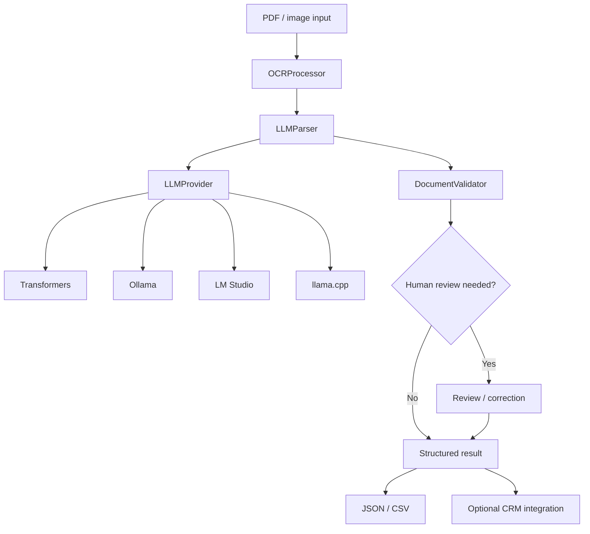

# MoneyPulse Architecture

MoneyPulse is organized as a local-first document-processing pipeline. The design separates document extraction, model inference, validation, and downstream integration so each layer can be tested or replaced independently.

## Processing flow

## Major components

### `src/ocr.py`

Converts PDFs and supported image formats into text using Tesseract OCR. PDF rendering is handled through `pdf2image`.

### `src/llm_providers.py`

Defines the common inference interface. Current providers are:

- in-process Hugging Face Transformers;
- Ollama;
- LM Studio through its OpenAI-compatible local API;
- llama.cpp through an OpenAI-compatible local API.

HTTP providers default to localhost endpoints and can be pointed at a different host through configuration.

### `src/llm.py`

Builds field-specific prompts and maps model responses into the MoneyPulse document schema. It records the provider and model used for each parsed document.

### `src/llm_detector.py`

Discovers supported local HTTP model servers, lists available models, tests a selected model, and produces pipeline-compatible configuration.

### `src/validator.py`

Applies deterministic validation after model extraction. Validation issues are preserved as review flags rather than silently ignored.

### `src/pipeline.py`

Coordinates OCR, model extraction, validation, output generation, and CRM submission. Successful results retain the extracted OCR text, processing metadata, provider, and model.

### `src/crm_submit.py`

Produces local JSON/CSV output and contains optional integration paths for external CRM systems. The default submission behavior remains a development/mock workflow.

### `src/gui/`

Contains the PySide6 desktop interface. The configuration dialog exposes local provider, host, and model selection.

## Trust boundaries

Model output is treated as untrusted input. The intended flow is:

1. extract source text;
2. ask a local model for structured fields;
3. validate deterministic formats and required fields;
4. flag questionable output for human review;
5. only then prepare downstream output.

The model does not decide whether an applicant should receive financing.

## Privacy boundaries

MoneyPulse can keep OCR and model inference local, but "local-first" is not the same as a guarantee that every deployment is offline.

Network activity can occur when:

- Python packages or model weights are downloaded;
- a configured model endpoint is not bound to localhost;
- an external CRM integration is enabled.

Deployers are responsible for access controls, log retention, model-server exposure, backups, and credentials.

## Current modernization direction

The project is moving toward:

- schema-validated model output;
- synthetic reproducible test fixtures;
- stronger OCR-independent integration tests;
- clearer provider discovery inside the main desktop UI;
- measured benchmarks instead of fixed marketing claims.
