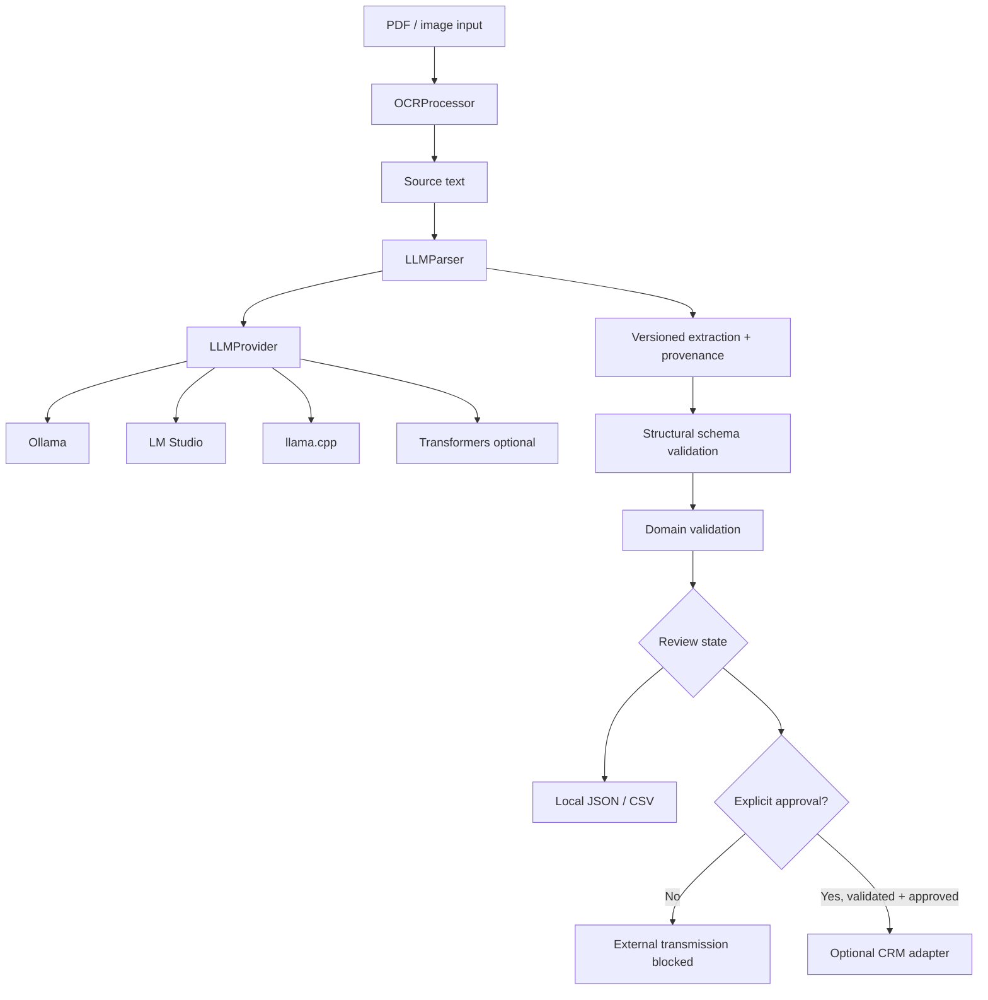

# MoneyPulse Architecture

MoneyPulse is a local-first document-processing pipeline with explicit boundaries between source extraction, untrusted model output, deterministic validation, review, and optional downstream transmission.

## Processing flow


```mermaid
flowchart TD
    A[PDF / image input] --> B[OCRProcessor]
    B --> C[Source text]
    C --> D[LLMParser]
    D --> E[LLMProvider]
    E --> E1[Ollama]
    E --> E2[LM Studio]
    E --> E3[llama.cpp]
    E --> E4[Transformers optional]
    D --> F[Versioned extraction + provenance]
    F --> G[Structural schema validation]
    G --> H[Domain validation]
    H --> I{Review state}
    I --> J[Local JSON / CSV]
    I --> K{Explicit approval?}
    K -->|No| L[External transmission blocked]
    K -->|Yes, validated + approved| M[Optional CRM adapter]
```

## Components

### `src/ocr.py`

Validates input paths and extensions, renders PDFs one page at a time with Poppler through `pdf2image`, preprocesses images with OpenCV, and extracts text with Tesseract. Render/OCR calls have timeouts. Missing files, unsupported types, corrupt images, and missing OCR tooling fail explicitly.

### `src/llm_providers.py`

Defines the model-provider interface. Local HTTP providers use explicit request timeouts and reject malformed response shapes. Provider connection tests also verify the configured model when the backend exposes a model list. The Transformers dependency is loaded only when that provider is selected.

### `src/llm.py`

Splits source text into word-bounded chunks and attempts each expected field across chunks. It records the raw response attempts used for provenance. Response cleanup strips only recognized field/answer prefixes, preserving legitimate colons inside values.

### `src/schema.py`

Defines extraction schema version `1.0` and validates exact expected fields, nested types, review metadata, and provenance. Unexpected/missing schema elements fail closed rather than being silently coerced.

### `src/validator.py`

Runs structural validation first, followed by deterministic domain checks for fields such as EIN/SSN, ZIP code, amount, phone, email, state, required fields, and partial addresses. It produces explicit review state without inventing model confidence.

### `src/pipeline.py`

Coordinates OCR, parsing, validation, and local output. A validation failure remains a reviewable completed extraction; a structural/provider/OCR exception returns an explicit failed processing result.

### `src/crm_submit.py`

The core `CRMSubmitter` creates local artifacts only. It does not simulate external acceptance or generate fake CRM IDs. `EnterpriseCRMSubmitter` is an optional adapter and blocks network transmission until deterministic validation has passed and explicit human approval is present.

CSV string cells are escaped at serialization to reduce spreadsheet formula injection. JSON retains original values. The public connector rechecks literal boolean approval and state, and the submitter blocks transmission after local output failure. Approval flags do not authenticate a user; integrations must supply trusted validation and approval metadata.

### `src/gui/`

Contains the PySide6 desktop interface and a separate provider-discovery widget. The main configuration dialog supports the provider IDs consumed by the pipeline. Provider discovery remains separate to avoid coupling startup to scanning local services.

The main desktop saves validated settings atomically, selects individual batch results, shows optional business/funding fields, and renders source/log strings as plain text. Input/configuration changes and overlapping workers are blocked while processing is active.

### `src/config.py` and `src/cli.py`

Configuration is a bounded set of provider/model/OCR settings stored in ignored local YAML. The headless CLI reuses `DocumentPipeline`, performs preflight checks, handles explicit input/configuration failures, and emits local result summaries with meaningful exit codes. No GUI dependency is imported by the CLI.

## Trust boundary

The intended boundary is:

```text
OCR text (source evidence)
    -> model response (untrusted)
    -> parsed extraction (untrusted)
    -> schema validation
    -> domain validation
    -> review state
    -> local output
    -> explicit human approval
    -> optional external integration
```

A model response never becomes trusted merely because it parsed successfully. Schema validation rejects unexpected structure, and domain validation does not turn an extraction into a credit/funding decision.

## Provenance

Extraction provenance records source file, provider/model, document chunk count, and raw field attempts. This helps a reviewer distinguish source/model behavior from validated values. Default CRM-shaped local output deliberately omits raw model-response provenance to avoid unnecessarily propagating model text downstream.

## Privacy boundaries

Local-first is not a guarantee of an offline deployment. Network access can occur for package/model downloads, non-local model endpoints, or approved CRM integrations. Operators remain responsible for endpoint exposure, credentials, filesystem permissions, retention, backups, and logs.

## Optional dependency boundaries

The default application does not require the in-process Transformers stack or enterprise SOAP/OAuth packages. Optional dependencies are separated into dedicated requirements files so unused integrations do not break the core application at import time.
