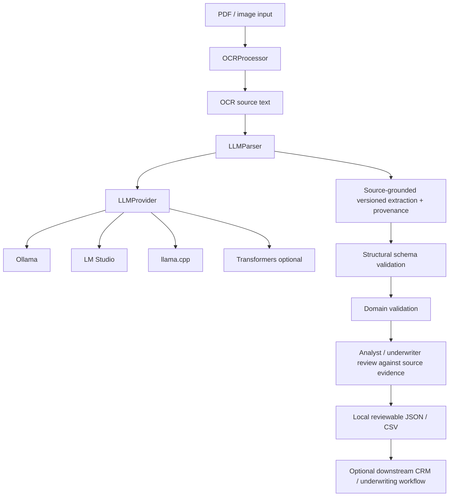

# MoneyPulse Architecture

MoneyPulse is a local-first document-processing pipeline with explicit boundaries between OCR source text, model-assisted field extraction, source grounding, deterministic validation, human review, and optional downstream systems.

## Processing flow


```mermaid
flowchart TD
    A[PDF / image input] --> B[OCRProcessor]
    B --> C[OCR source text]
    C --> D[LLMParser]
    D --> E[LLMProvider]
    E --> E1[Ollama]
    E --> E2[LM Studio]
    E --> E3[llama.cpp]
    E --> E4[Transformers optional]
    D --> F[Source-grounded versioned extraction + provenance]
    F --> G[Structural schema validation]
    G --> H[Domain validation]
    H --> I[Analyst / underwriter review against source evidence]
    I --> J[Local reviewable JSON / CSV]
    J --> K[Optional downstream CRM / underwriting workflow]
```

## Components

### `src/ocr.py`

Validates input paths and extensions, renders PDFs one page at a time with Poppler through `pdf2image`, preprocesses images with OpenCV, and extracts text with Tesseract. Render/OCR calls have timeouts. Missing files, unsupported types, corrupt images, and missing OCR tooling fail explicitly.

### `src/llm_providers.py`

Defines the model-provider interface. Local HTTP providers use explicit request timeouts and reject malformed response shapes. Provider connection tests also verify the configured model when the backend exposes a model list. The Transformers dependency is loaded only when that provider is selected.

### `src/llm.py`

Splits source text into word-bounded chunks and attempts each expected field across chunks. The model is used as a field-mapping aid.

A model-proposed value must reconcile with the OCR chunk that produced it before propagation. Unsupported guesses are discarded, and raw attempts remain in provenance. If a financial value such as annual revenue, processing volume, years in business, or requested amount is not supported by OCR source text, MoneyPulse leaves it missing rather than inferring it.

Response cleanup strips only recognized field/answer prefixes, preserving legitimate colons inside values.

### `src/schema.py`

Defines extraction schema version `1.0` and validates exact expected fields, nested types, review metadata, and provenance. Unexpected/missing schema elements fail closed rather than being silently coerced.

### `src/validator.py`

Runs structural validation first, followed by deterministic domain checks for fields such as EIN/SSN, ZIP code, amount, phone, email, state, required fields, and partial addresses. It produces explicit review state without inventing model confidence.

### `src/pipeline.py`

Coordinates OCR, parsing, validation, review state, and local output. A validation failure remains a reviewable completed extraction; a structural/provider/OCR exception returns an explicit failed processing result.

### `src/crm_submit.py`

The core `CRMSubmitter` creates local artifacts only. `EnterpriseCRMSubmitter` is an optional adapter and blocks network transmission until deterministic validation has passed and explicit human approval is present.

CSV string cells are escaped at serialization to reduce spreadsheet formula injection. JSON retains original values. The public connector rechecks literal boolean approval and state, and the submitter blocks transmission after local output failure.

### `src/gui/`

Contains the PySide6 desktop interface and a separate provider-discovery widget. The main configuration dialog supports the provider IDs consumed by the pipeline. Provider discovery remains separate to avoid coupling startup to scanning local services.

The desktop shows OCR text, extracted fields, validation/review state, local-model configuration, and batch results. Input/configuration changes and overlapping workers are blocked while processing is active.

### `src/config.py` and `src/cli.py`

Configuration is a bounded set of provider/model/OCR settings stored in ignored local YAML. The headless CLI reuses `DocumentPipeline`, performs preflight checks, handles explicit input/configuration failures, and emits local result summaries with meaningful exit codes. No GUI dependency is imported by the CLI.

## Trust boundary

```text
OCR text (source evidence)
    -> model-proposed field value (untrusted)
    -> source-grounded structured field
    -> schema validation
    -> domain validation
    -> human review against source evidence
    -> reviewed structured data
    -> optional downstream workflow
```

A model response never becomes trusted merely because it parsed successfully. Missing values are not supplied by model inference.

For raw bank statements or processor statements, deriving revenue, deposit history, processing volume, or similar underwriting metrics requires dedicated statement-analysis logic; generic field extraction is not treated as a substitute.

## Provenance

Extraction provenance records source file, provider/model, document chunk count, and raw field attempts. This helps a reviewer distinguish source/model behavior from accepted structured values. Default CRM-shaped local output deliberately omits raw model-response provenance to avoid unnecessarily propagating model text downstream.

## Privacy boundaries

Local-first is not a guarantee of an offline deployment. Network access can occur for package/model downloads, non-local model endpoints, or approved CRM integrations. Operators remain responsible for endpoint exposure, credentials, filesystem permissions, retention, backups, and logs.

## Optional dependency boundaries

The default application does not require the in-process Transformers stack or enterprise SOAP/OAuth packages. Optional dependencies are separated into dedicated requirements files so unused integrations do not break the core application at import time.
